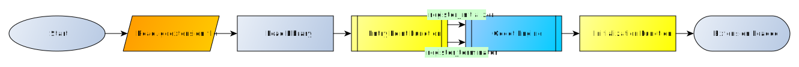

Extension Configuration
-----------------------
A description of the steps required to customize the extension:

* Change the :term:`library` name
* Edit the :term:`entry symbol` to reflect the new :term:`library` name
* Adjust extension paths to reflect new the :term:`library` name
* Update the :term:`entry point` function signature with the new :term:`entry symbol`

CMake Configuration
============================
The default :term:`library` name is ``EXTENSION-NAME`` and to change it, the CMakeLists.txt file is edited.
While there is nothing wrong with keeping the :term:`project` directory as is, it might be better
to rename it to something more suitable.  So if desired rename the :term:`project` directory.

For the purposes of this example the :term:`project` directory will be renamed to :term:`demo`, and the
:term:`library` name will be renamed to :term:`cooldemo`.

Change Library Name
^^^^^^^^^^^^^^^^^^^
Open CMakeLists.txt and find the following line:

.. code:: cmake

    set(LIBNAME "EXTENSION-NAME") # "The name of the library"

Change ``EXTENSION-NAME`` to be the name of the library like so:

.. code:: cmake

    set(LIBNAME "cooldemo") # "The name of the library"

Change Project Directory
^^^^^^^^^^^^^^^^^^^^^^^^
Beneath that line should be where it sets the directory for the :term:`project`, if the name of the :term:`project`
directory was changed, it has to be changed here to.  Find the line:

.. code:: cmake

    set(GODOT_PROJECT_DIR "project" CACHE STRING "The directory of a Godot project folder")

Change ``project`` to be the new name of the :term:`project` directory.

.. code:: cmake

    set(GODOT_PROJECT_DIR "demo" CACHE STRING "The directory of a Godot project folder")

Include Prefix In Library Name
^^^^^^^^^^^^^^^^^^^^^^^^^^^^^^
Currently the CMakeLists.txt file does not currently set a prefix for the :term:`library` name.
While this is in no way a problem, it results in the :term:`library's<library>` name not following naming conventions on
some :term:`target platforms<target platform>`.

If you want to add prefix generation, which is optional, expand the next
paragraph and follow the instructions.

.. admonition:: Prefix Generation
   :class: dropdown

   To add prefix generation to the cmake configuration open CMakeLists.txt, and scroll down to near the bottom where this
   block of code is:

   .. code:: cmake

       set_target_properties(${LIBNAME}
       PROPERTIES
       # The generator expression here prevents msvc from adding a Debug or Release subdir.
       RUNTIME_OUTPUT_DIRECTORY "$<1:${PROJECT_SOURCE_DIR}/bin/${GODOTCPP_PLATFORM}>"

       PREFIX ""
       OUTPUT_NAME "${LIBNAME}${GODOTCPP_SUFFIX}"
       )

   Just above it insert the following code, which will detect the :term:`target platform`, and if the :term:`target platform`
   is anything but windows, the :term:`library`'s filename will have a prefix of ``lib``:

   .. code:: cmake

       if(WIN32)
           set(LIBPREFIX "")
       else ()
           set(LIBPREFIX "lib")
       endif ()

   Next edit the original block and change ``PREFIX ""`` with ``PREFIX "${LIBPREFIX}"``.

Extension Configuration
=======================

The :term:`.gdextension file` in the :term:`project` contains the instructions for how to load the :term:`extension`.
The instructions are separated into specific sections.  The libraries section contains the path to the compiled :term:`library`,
for each :term:`host platform`, these paths are relative to the :term:`.gdextension file`.

Now that cmake compiles the :term:`library` with a different name, in order for :term:`Godot` to be able to load the :term:`extension`,
the :term:`library`'s path has to be updated in the :term:`.gdextension file`.  First the :term:`entry symbol` has to be renamed.

Open the :term:`extension`'s :term:`.gdextension file` for example (``demo/bin/example.gdextension``).

Change Entry Symbol
^^^^^^^^^^^^^^^^^^^
The value of the ``entry_symbol`` key, in the configuration section of the :term:`.gdextension file` defines the name of
the :term:`entry point function`, which will be the first function executed when the :term:`extension` is loaded.

Find the configurations section (it should be near the top) and looks like this:

.. code-block:: INI
   :emphasize-lines: 3

    [configuration]

    entry_symbol = "example_library_init"
    compatibility_minimum = "4.1"
    reloadable = false

Change the :term:`entry symbol` from ``example_library_init`` to ``libraryname_library_init``, so for the :term:`cooldemo`
:term:`library` in the example, it is changed to this:

.. code-block:: INI
   :emphasize-lines: 3

    [configuration]

    entry_symbol = "cooldemo_library_init"
    compatibility_minimum = "4.1"
    reloadable = false

Change Extension Path
^^^^^^^^^^^^^^^^^^^^^

Have a look at the library section, this section informs :term:`Godot` of the path to the :term:`extension`'s
:term:`library` for each :term:`target platform`.  These paths are relative to the :term:`.gdextension file`.

To adjust the paths in this section it is easiest to just do a find and replace.

If the CMakeLists.txt file was altered to generate the lib prefix on systems other than windows,
find "``EXTENSION-NAME``" and replace with the actual :term:`library` name like "``cooldemo``".

Otherwise find "``libEXTENSION-NAME``" and replace it with the :term:`library` name, this will fix the non windows names.
Now find "``EXTENSION-NAME``" and replace it with the :term:`library` name to fix the rest.

Change File Name
^^^^^^^^^^^^^^^^

Technically the name portion of the :term:`.gdextension file` doesn't matter, as :term:`Godot` loads it based on the file extension
however it is recommended that the :term:`.gdextension file` be renamed.

Currently the :term:`.gdextension file` is named "``example.gdextension``" , rename it to reflect the :term:`library`
name, for example "``cooldemo.gdextension``".

Source Code Configuration
=========================

The last step is to edit the source code in :term:`register_types.cpp` which can be found in the ``src`` directory.

When :term:`Godot` loads the :term:`project` it will scan the bin sub directory for any :term:`.gdextension files<.gdextension file>`,
it then uses the libraries section of the :term:`.gdextension file` to determine the path for the :term:`library` on
the current :term:`host platform`.  This path is used to load the :term:`library`, and the :term:`entry symbol` in the
:term:`.gdextension file` tells :term:`Godot` which function is to be used as the :term:`entry point function`.

    Extension Load Flow

The :term:`Entry Point Function` is the first function executed when the :term:`library` is loaded, inside this function
:term:`GDExtensionBinding::InitObject` is used to register the :term:`Initialization Function` and :term:`Deinitialization Function`
for callbacks using :term:`register_initializer` and :term:`register_terminator`.

Entry Point Function
^^^^^^^^^^^^^^^^^^^^

Open :term:`register_types.cpp` and scroll to the :term:`entry point function` it looks like this:

.. literalinclude:: ../share/entry_point_function.c
   :language: c
   :caption: Entry Point Function
   :emphasize-lines: 4

Now replace the name of the function to be the same as the name chosen as the :term:`entry symbol`
in the :term:`.gdextension file`.  For the :term:`cooldemo` example the original,
``example_library_init`` would become ``cooldemo_library_init``.

At this point the :term:`extension` is properly configured, and can be built and tested.
However while the file is open, let's examine the :term:`Initialization Function` to see how the extension's
"``ExampleClass``" is registered, as well as a look at the :term:`Deinitialization Function`.

Initialization Function
^^^^^^^^^^^^^^^^^^^^^^^
Near the top of the file is the :term:`initialization function` which is named ``initialize_gdextension_types``,
it is registered in the :term:`entry point function` using :term:`register_initializer` from :term:`godot-cpp`.

.. admonition:: Entry Point : register_initializer
   :class: dropdown

   .. literalinclude:: ../share/entry_point_function.c
      :language: c
      :caption: register_initializer
      :emphasize-lines: 7

Within the :term:`initialization function` , register classes with :term:`ClassDB`
using "``GDREGISTER_CLASS(ClassName)``" specifically during the SCENE level to make them available in the editor.  The
:term:`extension` currently registers a single class, named ExampleClass.

.. code-block:: cpp
   :emphasize-lines: 6

   void initialize_gdextension_types(ModuleInitializationLevel p_level)
   {
       if (p_level != MODULE_INITIALIZATION_LEVEL_SCENE) {
           return;
       }
       GDREGISTER_CLASS(ExampleClass);
   }

The example class implements a function called "``print_type``" :

.. admonition:: print_type
   :class: dropdown

   .. code-block:: cpp

      void ExampleClass::print_type(const Variant &p_variant) const {
          print_line(vformat("Type: %d", p_variant.get_type()));
      }

To see how the ``ExampleClass`` is used in Godot to print "``Type: 24``", open ``demo/example.gd`` which is
the script attached to the main scene.

.. admonition:: example.gd
   :class: dropdown

   .. code-block:: gd

      extends Node

      func _ready() -> void:
          var example := ExampleClass.new()
          example.print_type(example)

When the scene reaches the ``_ready()`` state, the example class object is instantiated in the standard way,
it then calls the ``print_type`` function passing itself as the argument.

Deinitialization Function
^^^^^^^^^^^^^^^^^^^^^^^^^
Just below the :term:`initialization function` is the :term:`deinitialization function` which is
named ``uninitialize_gdextension_types``, it is registered in the :term:`entry point function`
using :term:`register_terminator` from :term:`godot-cpp`.

.. admonition:: Entry Point : register_terminator
   :class: dropdown

   .. literalinclude:: ../share/entry_point_function.c
      :language: c
      :caption: register_terminator
      :emphasize-lines: 8

Typical Usage:

.. code:: cpp

   void uninitialize_gdextension_types(ModuleInitializationLevel p_level) {
       if (p_level != MODULE_INITIALIZATION_LEVEL_SCENE) {
           return;
       }
       // cleanup registration here
   }

This function is empty as the extension currently requires no cleanup.

.. warning::

    * Hot Reloading Warning: If you are using hot reloading (reloadable = true in .gdextension), failing to implement this function properly can lead to crashes in Main::cleanup()
    * Singleton Cleanup: If you registered singletons, they must be unregistered here. Be cautious with GDExtensionManager, ResourceUID, or IP singletons, as they can cause crashes if not handled correctly during shutdown
    * Static Variable Issues: Do not use static variables with Godot types (like RID or Node) in your classes, as they may be destroyed after the GDExtension system has already shut down.

Build and Test
==============

Now it's time to build and test the library with the new configuration.

Build
^^^^^

Compile the new version of the extension, with the configuration changes

.. code:: shell

   cmake --build cmake-build

Test
^^^^
The project can now be tested by launching the Godot editor and importing the project folder, or alternatively
the command line can be used to launch the Godot editor and load the project.  To do so the command is

``/path/to/godot.executable --editor --path /absolute/path/to/project``

After the project is loaded in the editor, the extension can be tested by running the main scene

Source Code
===========

:ref:`coderef101`

:ref:`coderef102`

:ref:`coderef103`

:ref:`coderef104`

:ref:`coderef105`

