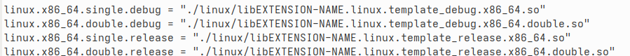

First Steps
-----------
An explanation of the initial steps required to acquire the official
`godot-cpp template <https://github.com/godotengine/godot-cpp-template>`_
and create a repository from it.  Further instruction follows in regards to cloning the repository, and
building the template's example project.

Clone Repository
================

First log into log in to GitHub, and then go to the
`official template repository <https://github.com/godotengine/godot-cpp-template>`_  and click the green
"Use this template" button at the top of the repository page.

This will let you create a copy of the repository with a clean git history.

Next clone the repository that was just created with the --recursive flag.  For example if the repository that was
created from the template is called mycooldemo:

.. code::

    git clone https://github.com/account/mycooldemo.git --recursive

Once cloned, you will have a project that is composed as follows:

.. list-table::
   :widths: 20 50
   :class: borderless

   * - .. figure:: img/intial_repo_content.png
          :width: 100%

          Initial Repository Content
     - #. bin folder
       #. class documentation for classes created for the extension
       #. godot-cpp bindings for creating the extension
       #. example project
       #. source code for the extension
       #. empty custom build profile
       #. cmake configuration file
       #. main file that is used by scons to build the project (not used by cmake)

.. note::
    If the repository was cloned without the ``--recursive`` flag, then the godot-cpp folder will be empty.  To remedy
    this open the repository folder in a terminal and execute the following;

    .. code::

        git submodule update --init

Initial Configuration
=====================

After cloning the repository cmake has to be configured. Open a terminal in the topmost level of the project that
was just cloned,  for example mycooldemo and execute the following:

.. code:: shell

   cmake -G Ninja -S . -B cmake-build-debug

| The value after the ``-B`` argument is the name of the folder that
  will be created as the cmake build folder, and can be referred to as
  ``${CMAKE_BINARY_DIR}`` in the ``CMakeLists.txt`` file.

The build directory is specified so that generated files do not clutter the source tree with build artifacts.

The value after the ``-G`` argument is the generator to be used, which in the above example is Ninja.

..
    .. note::
        CMake doesn't build the code, it generates the files that a build tool uses, in this case the Ninja generator creates
        Ninja build files.

        To see the list of available generators, in a terminal run

        .. code:: shell

            cmake -E capabilities

        and look for the generators array, it will contain the generators available to cmake.

If the generator is Ninja or Makefiles you can use the configure target to also generate a ``compile_commands.json`` in the build folder
that can be used with clangd.

.. code:: shell

   cmake -G Ninja -S . -B cmake-build-debug -DCMAKE_EXPORT_COMPILE_COMMANDS=ON

Initial Build
=============

Once configured the extension can be built by specifying a target of build followed by the name
of the cmake build folder:

.. code:: shell

   cmake --build cmake-build-debug

If the build command worked, you should have a new library file for the
target system in the project folder.  The example project folder contains the following:

.. list-table::
   :widths: 20 50
   :class: borderless

   * - .. figure:: img/project_content.png
          :width: 100%

          Project Folder
     - #. contains compiled library and extension configuration
       #. standard Godot project.

The bin folder of the project contains the output of the build.

.. list-table::
   :widths: 20 50
   :class: borderless

   * - .. figure:: img/project_bin.png
          :width: 100%

          Project Bin Folder
     - #. compiled libraries for target systems indicated by folder name
       #. configuration file for the extension

Reviewing the Build
^^^^^^^^^^^^^^^^^^^

Opening the folder of the target system that matches the current build platform should reveal the library
file that was built above.  For example on linux, open the linux folder to see the compiled library.

On linux the file will be named something like ``EXTENSION-NAME.linux.template_debug.x86_64.so``

Now open the configuration file for the extension, ``example.gdextension``

Look for the block of paths for the current platform, and check that the extension path corresponds to the correct name
for the compiled library.  For example:

If the path name in the configuration file is different than the actual path, for example if the configuration
file lists

.. code::

    "./linux/libEXTENSION-NAME.linux.template_debug.x86_64.so"

And the actual library is named ``EXTENSION-NAME.linux.template_debug.x86_64.so`` then the path in the configuration
will have to be adjusted to account for the lack of the ``lib`` prefix.  A failure to do so will result in a file
not found error when the project is opened in Godot.

Testing the Build
^^^^^^^^^^^^^^^^^
The project can now be tested by launching the Godot editor, importing the project folder and running
the main scene. It should print the following in the console:

::

   Type: 24